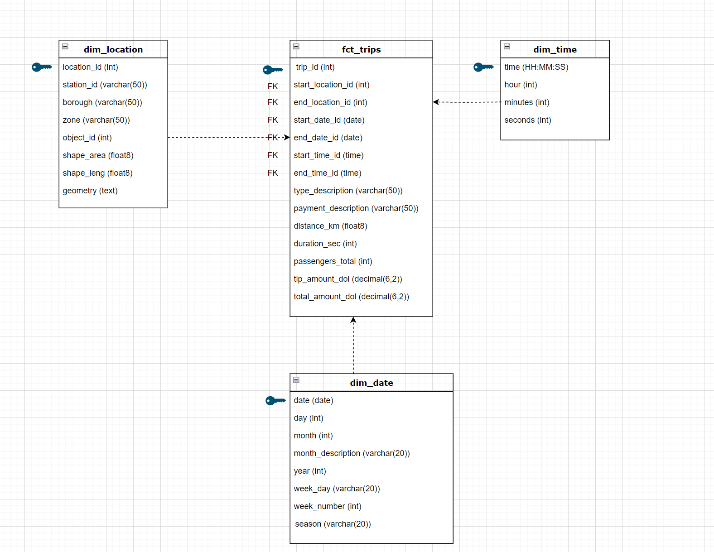

# Welcome to your first dbt project!

## Getting started

### Introduction to DBT

DBT (Data Build Tool) is an open-source software tool to modularize and centralize the SQL code. It simplifies the ETL process by focusing on the Transformation and modulation of data in the data warehouse. 

#### How it works?  

With DBT we can assure the characteristics below:

1. **Modularity:** DBT promotes a modular approach to data transformations. We can break down complex transformations into smaller, reusable pieces called `models`. These models represent individual tables or views in the data warehouse and can be easily combined and reused in different contexts. Besides the models, it is possible to create reusable SQL code (functions) through `macros` and invoke them multiple times across different models.

2. **Dependency Management:** DBT automatically manages dependencies between different data transformations. It uses a DAG (Directed Acyclic Graph) to track dependencies and ensure that transformations are executed in the correct order, optimizing performance and preventing errors. This is assured through [Jinja](https://docs.getdbt.com/docs/build/jinja-macros) and macros statements, such as **Ref** and **Source**. Jinja is a templating language that allows for dynamic content generation within SQL and YAML files in DBT projects

3. **Testing:** DBT includes built-in testing functionality that allows us to define and run tests on our data transformations. This helps ensure data quality, validate assumptions, and detect errors early in the development process.

4. **Documentation:** DBT generates documentation automatically based on the SQL code written. This documentation provides valuable insights into the data transformations, including descriptions of tables and columns, data lineage, and business logic. This documentation can be generated and rendered as a website.

Also, there’s no need to write code to create tables and views, or to define the order of execution of your models. Instead, dbt handles turning these models into objects in your warehouse for us (https://docs.getdbt.com/docs/build/sql-models).

DBT has two main products, the DBT Cloud and the DBT Core. We will focus on the **DBT Core** in this session.

#### DBT project components
A project includes information about the context of your project and how to transform your data. By design, a DBT project has the following resources:

| Resources | Description |
| ------------- | ------------- |
|**`dbt_project.yml`**| The project configuration file. At a minimum, all a project needs is the dbt_project.yml project configuration file.|
|**`profiles.yml`**| Configuration file used to define the connections to the databases.|
| snapshots | A way to capture the state of your mutable tables so you can refer to it later. |
| **seeds**  | CSV files with static data that you can load into your data platform with dbt.  |
| tests  | SQL queries that you can write to test the models and resources in your project.  |
| **macros** | Blocks of code that you can reuse multiple times.  |
| **sources**  | A way to name and describe the data loaded into your warehouse by your Extract and Load tools.  |
| analyses  | A way to organize analytical SQL queries in your project.  |
| **models**  | This folder typically contains the SQL files defining the data transformation logic. These SQL files are often organized into subfolders based on logical groupings of related data transformations. |


#### DBT commands

1. To run models within the project

```bash
 dbt run  # Run all models
 dbt run  --select <model_name> # Run a specific model
 dbt run  --full-refresh # Reprocess incremental models
 ```

2. To compile and catch errors before running dbt run.
This command also creates the manifest.json which holds a full representation of the dbt's project resources.
The manifest files from different project versions can be used to deploy just the added or changed elements.

```bash
 dbt compile 
```

3. To run all tests within the project
```bash
 dbt test
```

4. To load csv files found in the seed-paths
```bash
 dbt seed # Run all seeds
 dbt seed --select [seed_name] # Run a specific seed
# If you have previously run dbt seed and you change the properties.yml file
# You'll need to run dbt seed --full-refresh for the changes to take effect
 dbt seed --full-refresh
```

5. Build (dbt run + dbt test + dbt snapshot + dbt seed) - in DAG order
```bash
 dbt build 
```

6. To download dependencies listed in the packages.yml file.
```bash
 dbt deps
```

7. To help deleting some folders frequently
```bash
# They are listed in the clean-targets list inside the dbt_project.yml file
 dbt clean
 ```

8. Command to work with the docs
```bash
# Generate the docs
 dbt docs generate

# Run the docs
 dbt docs serve

```

9. Run a macro
```bash
 dbt run-operation <macro_name> --args '{args}'
 ```

#### References
https://docs.getdbt.com/docs/introduction

### Install DBT-Core

1. Create a new venv:
```python -m venv dbt-env```
2. Activate the new venv:
```source dbt-env/bin/activate```
3. Install dbt-core:
```python -m pip install dbt-core``` 
4. Check if dbt was installed:
```dbt --version```
5. Install dbt-postgres:
```pip install dbt-postgres```
6. Check if you the new package has been installed:
```dbt --version```
 

#### References
https://docs.getdbt.com/docs/core/installation-overview

## DBT exercises

At this stage of the course, you should have the t_yellow_cabs and t_city_bikes tables loaded into your schema. These two datasets provide information about trips that occurred by taxi and bikes in NYC, including the start and end time/location of the trip, travel distance, travel duration, etc., in a non-standardized way. In the diagram below we have the relational database that results of the standardization of this two main tables.



The goal of this session is to create a DBT project to generate those relational tables.
You will develop the project step by step through the exercises below.

**Enjoy it! :D**

#### Prerequisites

By this stage you should have already:
- DBT-Core installed
- Your own schema on the database
- The following datasets ingested from the previous sessions:
    - t_yellow_cabs
    - t_city_bikes
    - t_taxi_zones_shp

### Exercise 1 - Tell DBT where the tables will be created
- **Question 1** - What dbt file allows us to configure the connection to our data warehouse?
- **Steps:**
    - Update the file with these properties:
        - **profile name:** for instance, academia
        - **hostname:** da7-data-warehouse.cre2iy7kuiri.eu-central-1.rds.amazonaws.com
        - **user:** [your_user_name]
        - **password:** [your_pass]
        - **port:** 5432
        - **database name:** playground
        - **schema:** [your schema]
        - **threads:** 2
    - Test the connection by running `dbt debug --profile [profile_name]`
- **Hints:**
    - Follow the [**Profile Configuration** section](https://docs.getdbt.com/docs/core/connect-data-platform/postgres-setup) to know more how to connect a Postgres database.
    - More details can be found on [DBT profiles documentation](https://docs.getdbt.com/docs/core/connect-data-platform/connection-profiles).

### Exercise 2 - Set project configurations
- **Question 1** - What is the main configuration file of dbt projects?
- **Steps:**
    - Update the file with these properties:
        - **name of the project:** [name_of_the_project]
        - **profile name:** fill with the name of the profile defined in the profiles.yml file
    - Add the configurations needed to persist documentation of the models and seeds on the database
- **Hints:**
    - To persist the documentation follow these [instructions](https://docs.getdbt.com/reference/resource-configs/persist_docs).
    - More details can be found on [DBT project documentation](https://docs.getdbt.com/reference/dbt_project.yml).


### Exercise 3 - Add seeds to the project
- **Question 1** - What are seeds used for?
- **Goal:** Add two static datasets with geolocation data for the zone and borough of the starting and ending points of taxi and bike trips (t_city_bikes_zone and t_taxi_zone). The csv files are already in the respective folders inside `seeds` main folder. Take a look!
- **Steps:**
    - Update the **t_city_bikes_zone** config file to insert:
        - **description of the seed:** Geolocation information of the citi bikes stations, such as the borough and zone.
        - **column types:**
            - terminal_id: float
            - borough: varchar(50)
            - zone: varchar(50)
        - **column descriptions:**
            - terminal_id: Identifier of the ending/starting station
            - borough: Name of the borough of the ending/starting station
            - zone: Name of the zone of the ending/starting station
    - Test the creation of the dataset t_city_bikes_zone on the the database by running the command `dbt seed --select "t_city_bikes_zone"`
    - Update the **t_taxi_zone** config file to insert:
        - **description of the seed:** axi Zones roughly based on NYC Department of City Planning's Neighborhood
      Tabulation Areas (NTAs) and are meant to approximate neighborhoods, so you can see which
      neighborhood a passenger was picked up in, and which neighborhood they were dropped off in. 
      Includes associated service_zone (EWR, Boro Zone, Yellow Zone).
        - **column types:**
            - location_id: integer
            - borough: varchar(50)
            - zone: varchar(50)
            - service_zone: varchar(50)
        - **column descriptions:**
            - location_id: Identifier of the zone
            - borough: Name of the borough
            - zone: Name of the zone
            - service_zone: Name of the service zone
     - Test the creation of the dataset t_taxi_zone on the the database by running the command `dbt seed --select "t_taxi_zone"`
- **Hints:**
    - More details can be found on [DBT seeds documentation](https://docs.getdbt.com/docs/build/seeds).
    - More about how to run seeds follow this [link](https://docs.getdbt.com/reference/commands/seed).

### Exercise 4 - Understand DBT sources
- **Question 1** - What are the sources designed for?
- **Question 2** - How many sources do we have on this project?
- **Question 3** - What are the advantages of using {{ source() }} function when select from source tables?
- **Question 4** - Where are declare the sources properties?

- **Steps:**
    - Update the schema in both sources configuration files.
    - Generate the columns and column types documentation using dbt codegen package.
- **Hint:**
    - [How to generate sources documentation](https://hub.getdbt.com/dbt-labs/codegen/latest/)

### Exercise 5 - How can I add custom functions to the project?
- **Goal:** As depicted in the relational diagram, the fct_trips table includes a distance_km column. However, the t_city_bikes source table lacks a corresponding distance column. We can derive this information by calculating the distance between the starting and ending points using their longitude and latitude coordinates. To achieve this, we'll implement the Haversine formula to compute the distance in kilometers.
- **Question 1** - How can I add a function to calculate the Haversine distance on our project?
- **Question 2** - How can I run the function?
- **Steps:**
    - Define the function according to the properties below.
    - The name of the function is: `haversine_distance_function`
    - The parameters are: `lat1, lon1, lat2, lon2`
    - The function body is:

        ```
        CASE
            -- Check for NULL values
            WHEN lat1 IS NULL OR lon1 IS NULL OR lat2 IS NULL OR lon2 IS NULL THEN
                NULL
            -- Check for out-of-range values
            WHEN lat1 < -90 OR lat1 > 90 OR lon1 < -180 OR lon1 > 180 OR lat2 < -90 OR lat2 > 90 OR lon2 < -180 OR lon2 > 180 THEN
                null
            when lat1=lat2 and lon1=lon2 then 0
            ELSE
                -- Haversine distance calculation
                6371 * ACOS(COS(RADIANS(lat1)) * COS(RADIANS(lat2)) * COS(RADIANS(lon2) - RADIANS(lon1)) +
                            SIN(RADIANS(lat1)) * SIN(RADIANS(lat2)))
        END;```
        
- **Hints:**
    - More details can be found on [DBT documentation](https://docs.getdbt.com/docs/build/jinja-macros).
    - [How to run macros in DBT?](https://docs.getdbt.com/reference/commands/run-operation)


### Exercise 6 - DBT models
- **Goal:** In the following set of exercises we will create our relational database, the dimension tables and the fact table with taxi and bikes trips data.
- **Question 1** - What are DBT models?
- **Question 2** - How can I run all models? How can I run a specific model?
- **Question 3** - In which folder should I create the models?
- **Question 4** - Why should we start creating the dimension tables first?

**NOTE: Take a look at the diagram with the tables to be created to see the columns names and their type.**

#### Exercise 6.1 - Time dimension table
- **Steps:**
    - Create the query to generate the time dimension table. **Hint:** take a look at the generate_series function.
    - Create the config yml file. You can named it as properties.yml. Add the following properties:
        - **the description:** The dim_time table contains attributes related to time, such as hours, minutes and seconds.
        - **the columns data types**
        - **the columns description**:
            Column        | Description
            ------------- | -------------
            time  | Time
            hour | Hour
            minutes  | Minutes
            seconds | Seconds
        - **constraints:** identify the primary keys, if they are unique, not_null and so on.
        - **tests:** Add the tests that you think that are relevant to validate the values of the columns. For instance, check if a value is unique.
    - Run the tests for this model
    - Run **just** the model dim_time
    - After running the model verify in DBeaver if:
        1. The table was created under your schema
        2. The descriptions of the columns and the model are visible in the database. Do you see them?
        3. The primary keys and other constraints have been persisted into the database
- **Hints:**
    - More details can be found on [DBT documentation](https://docs.getdbt.com/docs/build/models).
    - More details about [constraints](https://docs.getdbt.com/reference/resource-properties/constraints)
    - More details about [tests]( https://docs.getdbt.com/reference/resource-properties/data-tests)
    - [Commands to run test]( https://docs.getdbt.com/reference/commands/test)
    - [Commands to run models](https://docs.getdbt.com/faqs/Runs/run-one-model)
    - [How to persist docs?](https://docs.getdbt.com/reference/resource-configs/persist_docs)

#### Exercise 6.2 - Date dimension table
- **Steps:**
    - Create the query to generate the date dimension table with dates between 2023-01-01 and 2024-01-01. **Hint:** take a look at the generate_series function.
    - Create the config yml file. You can named it as properties.yml. Add the following properties:
        - **the description:** The dim_date table, often referred to as a date dimension or calendar table, is a special type of table commonly used in data warehousing and analytics. It contains a comprehensive list of dates along with various attributes associated with each date, such as year, month, day of week, day of month, and so on. This table only shows the dates between 2023-01-01 and 2024-01-01.
        - **the columns data types**
        - **the columns description**:
            Column        | Description
            ------------- | -------------
            date  | Date
            day | day
            month  | Month
            month_description | The full name of the month
            year  | Year
            week_day | Day of the week
            week_number  | The number of the week
            season | The season according to the date
        - **constraints:** identify the primary keys, if they are unique, not_null and so on.
        - **tests:** 
            - Check if the values in the `season` column belong to this set: Spring, Winter, Summer, Autumn
            - Add other tests that you think that are relevant to validate the values of the columns. For instance, check if a value is unique.
    - Run the tests for this model
    - **Question:** Change the 'Spring' value to 'Sprin' and run the tests again. What happens?
    - Run **just** the model dim_date
    - After running the model verify in DBeaver if:
        1. The table was created under your schema
        2. The descriptions of the columns and the model are visible in the database. Do you see them?
        3. The primary keys and other constraints have been persisted into the database
- **Hints:**
    - More details can be found on [DBT documentation](https://docs.getdbt.com/docs/build/models).
    - More details about [constraints](https://docs.getdbt.com/reference/resource-properties/constraints)
    - More details about [tests]( https://docs.getdbt.com/reference/resource-properties/data-tests)
    - [Commands to run test]( https://docs.getdbt.com/reference/commands/test)
    - [Commands to run models](https://docs.getdbt.com/faqs/Runs/run-one-model)
    - [How to persist docs?](https://docs.getdbt.com/reference/resource-configs/persist_docs)

#### Exercise 6.3 - Location dimension table
- **Steps:**
    - Use this query to create the `dim_location`. **Replace the schema_name with your schema!**

    ```
    with geolocation_start_taxi AS (
	select cast(cabs.do_location_id as varchar) station_id, 
	case when ttz_start.location_id is null or ttz_start_shp.locationid is null then 'Unknown' else ttz_start.borough end as borough,
	case when ttz_start.location_id is null or ttz_start_shp.locationid is null then 'Unknown' else ttz_start.zone end as "zone",
	cast(ttz_start_shp.objectid as int), 
	cast(ttz_start_shp.shape_area as float), 
	cast(ttz_start_shp.shape_leng as float), 
	cast(ttz_start_shp.geometry as text)
	from schema_name.taxis cabs
	left join schema_name.t_taxi_zone ttz_start on cabs.do_location_id = cast(ttz_start.location_id as varchar)
	left join schema_name.t_taxi_zones_shp ttz_start_shp on ttz_start.location_id = ttz_start_shp.objectid
    ),
    geolocation_end_taxi AS (
        select cast(cabs.pu_location_id as varchar) station_id, 
        case when ttz_end.location_id is null or ttz_end_shp.locationid is null then 'Unknown' else ttz_end.borough end as borough,
        case when ttz_end.location_id is null or ttz_end_shp.locationid is null then 'Unknown' else ttz_end.zone end as "zone",
        cast(ttz_end_shp.objectid as int), 
        cast(ttz_end_shp.shape_area as float), 
        cast(ttz_end_shp.shape_leng as float), 
        cast(ttz_end_shp.geometry as text)
        from schema_name.taxis cabs
        left join schema_name.t_taxi_zone ttz_end on cabs.pu_location_id = cast(ttz_end.location_id as varchar)
        left join schema_name.t_taxi_zones_shp ttz_end_shp on ttz_end.location_id = ttz_end_shp.objectid
    ),
    geolocation_start_bikes as(
        select distinct cast(start_station_id as varchar) station_id, 
        case when start_zone.terminal_id is null then 'Unknown' else start_zone.borough end as borough,
        case when start_zone.terminal_id is null then 'Unknown' else start_zone.zone end as "zone",
        cast(null as int) as object_id, 
        cast(null as float) as shape_area, 
        cast(null as float) as shape_leng, 
        cast(null as text) as geometry
        from schema_name.t_city_bikes b
        left join schema_name.t_city_bikes_zone start_zone on b.start_station_id = cast(start_zone.terminal_id as varchar)
    ),
    geolocation_end_bikes as(
        select distinct cast(end_station_id as varchar) station_id, 
        case when end_zone.terminal_id is null then 'Unknown' else end_zone.borough end as borough,
        case when end_zone.terminal_id is null then 'Unknown' else end_zone.zone end as "zone",
        cast(null as int) as object_id, 
        cast(null as float) as shape_area, 
        cast(null as float) as shape_leng, 
        cast(null as text) as geometry
        from schema_name.t_city_bikes b
        left join schema_name.t_city_bikes_zone end_zone on b.end_station_id = cast(end_zone.terminal_id as varchar)
        where b.end_station_id <>''
    ),
    geolocation_taxi as(
        select * from geolocation_start_taxi
        union
        select * from geolocation_end_taxi
    ),
    geolocation_bikes as(
        select * from geolocation_start_bikes
        union
        select * from geolocation_end_bikes
    ),
    -- Merge citibikes and taxi locations
    merge_locations as (
        select * from geolocation_bikes
        union all
        select * from geolocation_taxi
    )
    select cast(row_number() over () as int) as location_id, *
    from merge_locations

    ```

    - Create the config yml file. You can named it as properties.yml. Add the following properties:
        - **the description:** This table provides information of the borough and zones of the start and end areas of trips. Also, it includes geolocation data.
        - **the columns data types**
        - **the columns description**:
            Column        | Description
            ------------- | -------------
            location_id  | Date
            station_id | Identifier of the starting and ending stations
            borough  | Borough
            Zone | Zone
            object_id  | 
            shape_area | 
            shape_leng  | 
            geometry | 
        - **constraints:** identify the primary keys, if they are unique, not_null and so on.
        - **tests:** 
            - Add tests that you think that are relevant to validate the values of the columns. For instance, check if a value is unique.
    - Run the tests for this model
    - Run **just** the model dim_location
    - After running the model verify in DBeaver if:
        1. The table was created under your schema
        2. The descriptions of the columns and the model are visible in the database. Do you see them?
        3. The primary keys and other constraints have been persisted into the database
- **Hints:**
    - More details can be found on [DBT documentation](https://docs.getdbt.com/docs/build/models).
    - More details about [constraints](https://docs.getdbt.com/reference/resource-properties/constraints)
    - More details about [tests]( https://docs.getdbt.com/reference/resource-properties/data-tests)
    - [Commands to run test]( https://docs.getdbt.com/reference/commands/test)
    - [Commands to run models](https://docs.getdbt.com/faqs/Runs/run-one-model)
    - [How to persist docs?](https://docs.getdbt.com/reference/resource-configs/persist_docs)

#### Exercise 6.4 - Fact table
- **Steps:**
    - Use this query to generate the fact table. **Replace the schema_name with your schema!**
    ``` 
    with taxi_table as (
	select dl_start.location_id as start_location_id, 
	dl_end.location_id as end_location_id, 
	dd_start.date as start_date_id, 
	dd_end.date as end_date_id,
	dt_start.time as start_time_id, 
	dt_end.time as end_time_id,
	'taxi' as type_description,
	case cabs.payment_type  
        when '1' then 'Credit card'
        when '2' then 'Cash'
        when '3' then 'No charge'
        when '4' then 'Dispute'
        when '5' then 'Unknown'
        when '6' then 'Voided trip'
        else 'EMPTY'
    end as payment_description,
    trip_distance * 1.60934 as distance_km, -- as km
    EXTRACT(EPOCH FROM (cast(cabs.tpep_dropoff_datetime as timestamp)-cast(cabs.tpep_pickup_datetime as timestamp))) as duration_sec,
    cabs.passenger_count as passengers_total,
    cabs.tip_amount as tip_amount_dol,
    cabs.total_amount as total_amount_dol
	from schema_name.taxis cabs
	inner join schema_name.dim_date dd_start on cast(cabs.tpep_pickup_datetime as date) = dd_start."date" 
	inner join schema_name.dim_date dd_end on cast(cabs.tpep_dropoff_datetime as date)  = dd_end."date"
	inner join schema_name.dim_time dt_start on cast(cabs.tpep_pickup_datetime as time) = dt_start."time" 
	inner join schema_name.dim_time dt_end on cast(cabs.tpep_dropoff_datetime as time)  = dt_end."time"
	join schema_name.dim_location dl_start on dl_start.station_id = cast(cabs.pu_location_id as varchar)
	join schema_name.dim_location dl_end on dl_end.station_id = cast(cabs.do_location_id as varchar)
   ),
    bike_table as (
        select dl_start.location_id as start_location_id, 
        dl_end.location_id as end_location_id, 
        dd_start.date as start_date_id, 
        dd_end.date as end_date_id,
        dt_start.time as start_time_id, 
        dt_end.time as end_time_id,
        rideable_type as type_description,
        'Credit card' as payment_description,
        haversine_distance(end_lat, end_lng, start_lat, start_lng) as distance_km,
        EXTRACT(EPOCH FROM (cast(ended_at as timestamp)-cast(started_at as timestamp))) as duration_sec,
        1 as passengers_total,
        0 as tip_amount_dol,
        0.20*(EXTRACT(EPOCH FROM (cast(ended_at as timestamp)-cast(started_at as timestamp)))/60) as total_amount_dol
        from schema_name.t_city_bikes tcb
        inner join schema_name.dim_date dd_start on cast(tcb.started_at as date) = dd_start."date" 
        inner join schema_name.dim_date dd_end on cast(tcb.ended_at as date)  = dd_end."date"
        inner join schema_name.dim_time dt_start on cast(tcb.started_at as time) = dt_start."time" 
        inner join schema_name.dim_time dt_end on cast(tcb.ended_at as time)  = dt_end."time"
        join schema_name.dim_location dl_start on cast(dl_start.station_id as varchar) = tcb.start_station_id
        join schema_name.dim_location dl_end on cast(dl_end.station_id as varchar) = tcb.end_station_id
        where tcb.end_station_id <>'' and tcb.end_station_id is not null
    ),
    trips as (
        select start_location_id, 
        end_location_id, 
        start_date_id, 
        end_date_id,
        start_time_id, 
        end_time_id,
        type_description,
        payment_description,
        distance_km, 
        cast(duration_sec as int),
        cast(passengers_total as int),
        tip_amount_dol,
        total_amount_dol
        from taxi_table
        union all 
        select start_location_id, 
        end_location_id, 
        start_date_id, 
        end_date_id,
        start_time_id, 
        end_time_id,
        type_description,
        payment_description,
        distance_km, 
        cast(duration_sec as int),
        cast(passengers_total as int),
        tip_amount_dol,
        total_amount_dol
        from bike_table
    )
    select cast(row_number() over () as int) as trip_id, *
    from trips
    ```
    - Create the config yml file. You can named it as properties.yml. Add the following properties:
        - **the description:** This fact table provides information about taxi and bike trips that occurred in NYC in 2023. It includes the starting and ending geographical and time information, the number of passengers, the total amount, the type of ride, the distance traveled, the duration of the trip, the tip amount and the payment method.
        - **the columns data types**
        - **the columns description**:
            Column        | Description
            ------------- | -------------
            trip_id  | Identifier of the trip
            start_location_id | ID of the starting location
            end_location_id  | ID of the ending location
            start_date_id | Trip start date
            end_date_id  | Trip end date
            start_time_id | Trip start time
            end_time_id  | Trip end time
            type_description | Type of the trip (eletric_bike, classic_bike or taxi)
            payment_description | Method of the payment
            distance_km  | Distance of the trip in km
            duration_sec | Duration of the trip in seconds
            passengers_total | Total of passengers
            tip_amount_dol | Tip amount in dollars
            total_amount_dol  | Total cost of the trip
        - **constraints:** identify the primary keys, foreign_keys (don't forget to identify the schema of the foreign table), if they are unique, not_null and so on.
        - **tests:** 
            - Add tests that you think that are relevant to validate the values of the columns. For instance, check if a value is unique.
    - Run the tests for this model
    - Run **just** the model fct_trips
    - After running the model verify in DBeaver if:
        1. The table was created under your schema
        2. The descriptions of the columns and the model are visible in the database. Do you see them?
        3. The primary keys and other constraints have been persisted into the database
- **Hints:**
    - More details can be found on [DBT documentation](https://docs.getdbt.com/docs/build/models).
    - More details about [constraints](https://docs.getdbt.com/reference/resource-properties/constraints)
    - More details about [tests]( https://docs.getdbt.com/reference/resource-properties/data-tests)
    - [Commands to run test]( https://docs.getdbt.com/reference/commands/test)
    - [Commands to run models](https://docs.getdbt.com/faqs/Runs/run-one-model)
    - [How to persist docs?](https://docs.getdbt.com/reference/resource-configs/persist_docs)

### Exercise 7 - DBT documentation
- **Goal:** Generate documentation locally. 
- **Introduction:** With dbt, we can systematically document our models and present this documentation to users in a structured manner, rendered as a website. 
- **Question 1** - How can I generate documentation?
- **Question 2** - Which files contribute to the generation of the documentation?
- **Question 3** - Run the commands to generate the documentation locally and check:
    1. If the descriptions of the columns and models are visible
    2. If the lineage graph of `fct_trips` is correct (includes links to the dimension tables). If not, what could be missing? 
    
- **Hints:** 
    - Take a look at https://docs.getdbt.com/reference/dbt-jinja-functions/ref and https://docs.getdbt.com/reference/dbt-jinja-functions/source for lineage grapgh issues
    - For more information about [documentation](https://docs.getdbt.com/docs/collaborate/documentation)
    - Learn more about the [commands to generate documentation](https://docs.getdbt.com/reference/commands/cmd-docs)

**NOTE:** You can run all models using this command: `dbt run`
